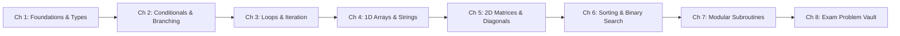

<div align="center">

  

  # ✦ ALGØ 1 — The Interactive Algorithmic Studio ✦
  ### *Where Scandinavian Editorial Minimalism Meets Playful 3D Micro-Interactions*

  <p align="center">
    A next-generation, high-vibe algorithmic study companion crafted for university students at <b>USTHB</b>.<br>
    Built from the ground up by <b>Ibrahim Benabida</b> to transform dry computer science theory into an engaging, gamified, tactile experience.
  </p>

  <p align="center">
    <a href="https://dsdsausthb.vercel.app"></a>
    <a href="https://github.com/blood-prog/dsdsa.usthb"></a>
    <a href="https://github.com/blood-prog"></a>
    
    
  </p>

  <p align="center">
    <a href="https://dsdsausthb.vercel.app"><b>🚀 Launch Live Application</b></a> •
    <a href="#-meet-the-creator-ibrahim-benabida"><b>👨‍💻 The Vibe Coder</b></a> •
    <a href="#-the-design-philosophy--vibe"><b>🎨 Design Philosophy</b></a> •
    <a href="#-curriculum-architecture"><b>📚 Curriculum Architecture</b></a> •
    <a href="#-interactive-features"><b>⚡ Interactive Labs</b></a>
  </p>

</div>

---

## 🌟 The Vibe & Design Philosophy

Most computer science guides look like dusty PDF lecture slides from 1998. **Algø 1** flips that paradigm on its head. 

Inspired by **Scandinavian editorial layouts**, modern **21st.dev component craft**, and **DataCamp's focus-driven progression**, every single screen was engineered to deliver maximum aesthetic pleasure and deep cognitive clarity:

```
┌────────────────────────────────────────────────────────────────────────┐
│  🎨 Editorial Calm       🧶 Playful 3D Tactility     ⚡ Algorithmic Depth │
│  Warm sandstone hues     Real-time Three.js Felt     Rigorous Knuth logic │
│  Generous whitespace     Interactive companion       54+ checkpoints      │
│  Zero loud clutter       44+ dynamic dark jokes      5 exam-level labs    │
└────────────────────────────────────────────────────────────────────────┘
```

- **Sensory Tactility**: Smooth spring-damper physics ($k=30, d=11$), twin-comet alpha border beam panels, and retro terminal window wrappers.
- **Byte (Your 3D Felt Companion)**: A living, breathing WebGL mascot with cozy felt yarn textures. He reacts to your successes, spins when clicked, and serves up 44+ non-repeating dark jokes and university survival quips.
- **Pedagogical Flow & Bridges**: Every single lesson ends with a **Pedagogical Bridge** explaining *why* this concept is the missing key to unlocking the next one.
- **Day & Night Atmospheres**: Effortless toggle between crisp sandstone daylight mode and an immersive OLED midnight carbon theme.
- **Zero Friction**: 100% client-side state saved in `localStorage`. No accounts, no passwords, no paywalls.

---

## 👨‍💻 Meet the Creator: Ibrahim Benabida

<table align="center" width="100%">
  <tr>
    <td width="30%" align="center" valign="middle">
      
      <br><br>
      <b>Ibrahim Benabida</b><br>
      <i>Computer Science Student @ USTHB</i><br>
      <b>Creative Frontend Vibe Coder</b><br><br>
      <a href="https://github.com/blood-prog"></a>
    </td>
    <td width="70%" valign="top">
      <h3>Hey, I'm Ibrahim! 👋</h3>
      <p>
        I'm a computer science student at <b>USTHB (University of Science and Technology Houari Boumediene)</b> in Algiers. I believe code isn't just about syntax—it's about <b>vibes, emotion, human intuition, and immaculate design</b>.
      </p>
      <p>
        As a <b>front-end vibe coder and creative developer</b>, I obsess over:
      </p>
      <ul>
        <li>✨ <b>Micro-Interactions that Delight:</b> Custom physics, kinetic animations, and responsive tactile feedback.</li>
        <li>🧶 <b>3D on the Web:</b> Bringing three-dimensional interactive characters (Three.js / WebGL / GLTF) into everyday web experiences.</li>
        <li>📐 <b>Architectural Typography:</b> Harmonizing font pairs (<i>Plus Jakarta Sans</i> + <i>JetBrains Mono</i>), golden-ratio spacing, and color theory.</li>
        <li>⚡ <b>Pure Performance:</b> Zero-dependency, lightweight vanilla architectures that load in milliseconds on mobile networks.</li>
      </ul>
      <p>
        ⭐ <b>If you enjoy my work or find this study guide useful, please drop a star on this repository!</b> It means the world and fuels future creative open-source builds.
      </p>
      <p>
        📫 <i>Open for creative frontend projects, collaborations, and conversations:</i><br>
        <b>GitHub:</b> <a href="https://github.com/blood-prog/blood-prog">@blood-prog</a> • <b>Platform:</b> <a href="https://dsdsausthb.vercel.app">dsdsausthb.vercel.app</a>
      </p>
    </td>
  </tr>
</table>

---

## 📚 Curriculum Architecture

Covering the complete first-half Semester 1 program across **8 Structured Chapters** and **26 In-Depth Lessons**:



### Syllabus Breakdown

| Chapter | Phase | Core Topics & Invariants | Interactive Checkpoints |
| :--- | :--- | :--- | :---: |
| **01. Foundations & Variables** | Week 01 | Donald Knuth's 5 properties, data types (`int`, `real`, `char`, `bool`), `DIV`/`MOD`, memory trace tables | 10 Checkpoints |
| **02. Conditionals & Decisions** | Week 02 | Boolean algebra, If-Then-Else, complete quadratic case tree ($ax^2 + bx + c = 0$), Switch/Case | 6 Checkpoints |
| **03. Repetition & Loops** | Week 02 | `For` counter loops, `While` pre-test loops, `Repeat-Until` post-test loops, sentinel accumulators | 8 Checkpoints |
| **04. 1D Arrays & Strings** | Week 03 | Contiguous memory allocation, 1-based indexing, extremum linear search, in-place reversal, ASCII codes | 8 Checkpoints |
| **05. 2D Matrices & Grids** | Week 03 | Row-major traversal, main diagonal ($i = j$), secondary diagonal ($i + j = N + 1$), saddle point detection | 6 Checkpoints |
| **06. Sorting & Binary Search** | Week 04 | Selection Sort ($O(N^2)$), Bubble Sort with early-exit flag ($O(N)$ best-case), Dichotomic Search ($O(\log_2 N)$) | 6 Checkpoints |
| **07. Modular Subroutines** | Week 05 | Functions vs Procedures, parameter passing (by value vs by reference `VAR`), call stack frames | 4 Checkpoints |
| **08. Exam Revision Vault** | Sheets 1 & 2 | Number theory (Armstrong numbers, Euclidean GCD), prefix sums, array rotation, array leaders | 4 Checkpoints |

---

## ⚡ Interactive Labs & Studios

### 1. 📊 Real-Time Sorting Studio
Interactive visualizer animating every swap, comparison, and partition in real time:
- **Selection Sort**: Visualizes the active minimum pointer hunting across the unsorted partition before executing exactly 1 swap per pass.
- **Bubble Sort**: Watch heavier elements "bubble" toward the right with early-termination flag detection on pre-sorted inputs.
- **Interactive Controls**: Adjustable animation speeds (Slow, Normal, Fast), customizable comma-separated inputs, and 4 test presets (Mixed, Worst-Case, Best-Case, Random).

### 2. 🎯 Logarithmic Binary Search Studio
- Halves the search interval on every comparison on sorted arrays in $O(\log_2 N)$ time.
- Color-coded pointer highlights for `Left`, `Mid`, and `Right` bounds.
- Real-time step counter demonstrating why searching 1,000,000 items requires fewer than 20 operations.

### 3. ✍️ 50-Question Master Certification Quiz
- Spans the complete syllabus with immediate visual feedback, detailed rationale explanations, and category filters.
- Quick navigation palette to jump directly between questions 1 through 50.
- Persistent score calculation stored in `localStorage`.

### 4. 🏆 5 University Exam-Level Solvers
Stress-test your understanding against high-difficulty university exam challenges:
- **Dual-Pivot Equilibrium**: $O(N)$ prefix-suffix balance detector handling negative numbers, zero balance, and boundary indices.
- **Strict Suffix Leaders**: Single backward pass identifying elements strictly greater than all subsequent values, with duplicate plateau defense.
- **Cyclic Array Rotation**: In-place Three-Reversal Theorem supporting Left/Right shifts, arbitrary $k > N$ ($k \pmod N$), and negative $k$.
- **Complete Quadratic Analyzer**: Exhaustive 6-branch decision tree evaluating degenerate linear cases, contradictions, double roots, and conjugate complex roots ($z = \alpha \pm i\beta$ in $\mathbb{C}$).
- **Matrix Multi-Saddle Inspector**: Evaluates row minimums and column maximums vectors across arbitrary $R \times C$ grids with Minimax Theorem verification.

---

## 🧶 Byte — The 3D Felt Mascot

Byte is the heart of Algø 1. Rendered in real-time with **Three.js** and **WebGL**, he brings warmth and humor to algorithmic problem solving:

- **Touch & Mouse Drag**: Grab Byte and place him anywhere on your screen.
- **Non-Repeating Dialogue Engine**: Equipped with a 20-statement history ring buffer that mathematically eliminates sentence ping-pong ($A \to B \to A \to B$).
- **44+ Dynamic Jokes**: Poke Byte to hear witty student jokes, dark programmer humor, and relatable USTHB campus quips:
  > *"My heap is corrupt, but at least it's not my GPA... yet. 💀"*<br>
  > *"Recursion without a base case: exactly how this semester feels. 🌀"*<br>
  > *"Why do programmers prefer dark mode? Because light attracts bugs... and harsh reality. 🪲"*

---

## 🛠️ Tech Stack & Craft

Designed with pure vanilla technologies for maximum speed, zero build friction, and instant deployment:

```
├── Architecture:      Vanilla ES6+ JavaScript (Zero heavyweight frameworks)
├── 3D Engine:         Three.js (r128) + GLTFLoader (Offline Fallback Capable)
├── Styling:           Modern CSS3 with CSS Custom Properties & Responsive Grid
├── Design Systems:    21st.dev Component Patterns + Motiq Border Beam Physics
├── Typography:        Plus Jakarta Sans + JetBrains Mono
├── Audio:             Web Audio API (Procedural synthesizer chirps)
├── Persistence:       Client-side HTML5 localStorage API
└── Hosting & CDN:     Vercel Edge Global Network
```

---

## 🚀 Quick Start (Run Locally)

You can run Algø 1 locally with zero dependencies:

```bash
# Clone the repository
git clone https://github.com/blood-prog/dsdsa.usthb.git

# Enter project directory
cd dsdsa.usthb

# Launch with Python 3
python -m http.server 3000

# Or launch with Node.js
npx serve .
```

Open `http://localhost:3000` in your web browser.

---

## 🌐 Deploy to Vercel

This repository includes a production-ready `vercel.json` with immutable asset caching and clean URLs:

1. Fork or push this repository to GitHub.
2. Head to [Vercel](https://vercel.com) and click **"New Project"**.
3. Import `dsdsa.usthb`.
4. Set domain to `dsdsausthb.vercel.app` (or your custom domain).
5. Click **"Deploy"**. Your site is live worldwide in seconds!

---

## 💖 Support & Stargazers

If this study guide helped you pass your exams or inspired your frontend design, please give this project a **Star ⭐**! It directly helps other USTHB students discover the platform.

<div align="center">

  [](https://github.com/blood-prog/dsdsa.usthb)

  <br>

  Made with ❤️ and endless curiosity by **[Ibrahim Benabida](https://github.com/blood-prog/blood-prog)**<br>
  *USTHB Faculty of Computer Science & Mathematics • Curriculum Track*

</div>
